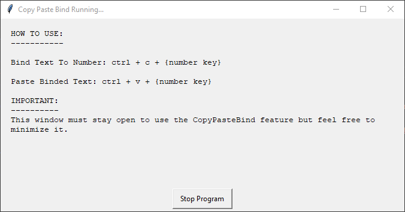

# CopyPasteBindToNumbersOnKeyboard
Simple desktop app that allows user to save copied text to numbers on keyboard. User can then use hotkey to paste saved values later on. 

### Prerequisites:
- Python 3.6.5 or similar. (So Windows/Mac/Linux can edit source code, but python doesn't need to be installed to run pre built executable.)
- WindowsOS 10 or later.
- Keyboard with numbers 0-9.

### Installation:
1.) Clone repository or download zip file.

2.) Find the "dist" folder in cloned repo or extracted folder.

3.) Run CopyPasteBind.exe file.

### Disabiling Application Shortcuts That Can Interfere w/ The Program:;
- Google Chrome has keyboard shortscuts for quickly moving between tabs by using ctrl + {number key}. To avoid this interfereing with the program we'll need to: 1.) disable these, OR 2.) move the tab we want to work with to its own window - this is much simpler. To disable the default browser hotkeys we need to install the "ShortKeys" chrome extension. Steps:

  1.) Right-click the "ShortKeys" chrome extension.
  
  2.) Select "Options".
  
  3.) Go to the "Import" tab.
  
  4.) Copy the contents of "DisableTabIndexShortcutsInGoogleChrome.txt" and paste into the text area.
  
  5.) Finish by clicking "Import" button beneath the text area. 
  
  6.) Congrats! The tab index shortcuts for chrome should now be disabled.
